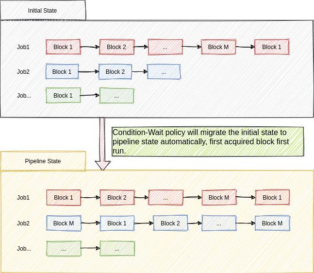
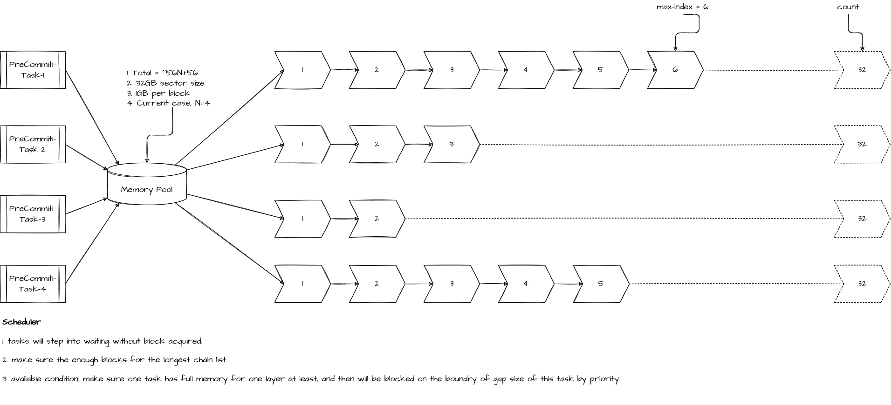

# Multi-Sector Memory Pool Support for the Sealing Precommit Phase1

<!-- START doctoc generated TOC please keep comment here to allow auto update -->

<!-- DON'T EDIT THIS SECTION, INSTEAD RE-RUN doctoc TO UPDATE -->

**Table of Contents**  *generated with [DocToc](https://github.com/thlorenz/doctoc)*

- [Introduction](#introduction)
  - [What does the multi-sector memory pool do?](#what-does-the-multi-sector-memory-pool-do)
  - [How to design the memory pool?](#how-to-design-the-memory-pool)

<!-- END doctoc generated TOC please keep comment here to allow auto update -->

This document describes the memory pool structures in the sealing procommit phase1, and covered the block allocator and layer slice management.

## Introduction

### What does the multi-sector memory pool do?

It is well known that the PoRep needs huge memory resource on the label creating during the sealing PreCommit Phase 1, which is composed of the base + exp layers. One 32GB-sector label creating will consume 64GB memory, and the 64GB sector needs 128GB. If we run N jobs with N sectors in parallel, the total memory comsumption will be N * 2 * SECTOR_SIZE.

In order to seal more data of one server, the common case is to enlarge the DDR memory to TB level, which also means high cost at the same time, so it is very important to make full use of these memory resource as possible as we can.

We find it needs long time on the label caculation for each layer, which means we have too much memory not been touched within some time. For example, if we need 20 minutes to finish one layer of a 32GB-sector task, then it just needs 2GB in the first 75s, and 4GB for the first 150s in roughly estimated, etc. if we split the sector into multi blocks as following, it seems a good scenario for memory pool model in pipeline, which almost has the same performance as before.



### How to design the memory pool?

Let's assume N jobs runing with N sectors, it will consume N * 2 * SECTOR_SIZE for all jobs working in parallel, which is the maximum threshold, and the minmum threshold case is (N + 1) * SECTOR_SIZE in that one job can be done with exp layer ready on each job at least. The remain jobs should be pending once the memory pool is only making sure the fastest job fully done, and which also will be waked up once other jobs's old expansion layer released.

So we can make sure the memory pool size range is as following:

```
MEM_POOL_SIZE <= N * 2 * SECTOR_SIZE
MEM_POOL_SIZE >= (N + 1) * SECTOR_SIZE
```

In the use case, it would be better that MEM_POOL_SIZE can be allowed changing by enviornment. we can use the middle case for good pipeline work in default as following,

```
MEM_POOL_SIZE = (3 * N + 1) * SECTOR_SIZE / 2
```

```rust
// minmum: S * (m + 1)
// medium: S * (3m + 1) / 2, number of m/2 tasks have enough memory.
// maxmum: S * 2m
// 
// eg: 6 tasks, 512MB sector
// count = 512M/32M * (3*6+1)/2 = 16 * 19 / 2 = 152
//
pub struct LabelPool {
    pub sector:     usize,
    pub tasks:      usize,
    pub block:      usize,
    pub count:      usize,
    pub total:      usize,

    pub maxidx:     usize,
    pub tidmap:     HashMap<ThreadId, usize>,
    pub idxmap:     Vec<usize>,
    pub banks:      Vec<usize>,
    pub pool:       Vec<u8>,
}
```

### **Pipeline Optimization**

It's difficault to run into good pipeline status, because it is out of order on the memory allocation and free, even worse case on some task blocked long time without any re-schedule. To keep the tasks running into the good pipeline status, we need make all the tasks allocating memory in order.



The gap between full memory and available memory will be grouped into a rank, which is enabled at layer2, and bind to to the tasks according to the launch time, That is the base of pipeline. Refer to the code base for details.
